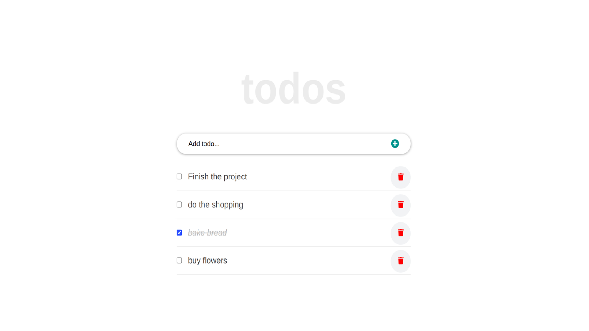

# To-Do App - using React

> This project comprises a simple list of To Do tasks.

On this To-Do list, items can be added. When tasks completed, marked them as so. Tasks can be edited and deleted.

## Built With

- Major languages: JavaScript, HTML & CSS;
- Frameworks: React;
- Technologies used: GitHub, GitFlow, Terminal;

## Live Demo

[https://nicupop729.github.io/to-do-app-with-react]()

## Getting Started

### Prerequisites

- Please make sure you have Node.js packedge installed on your terminal.

### Setup

To get a local copy up and running follow these simple steps.

To setup the To-Do App project in your local, in the repo page:
click on code (dropdown list) > Download as ZIP;
or open terminal of path you want to install project and run this command  
`git clone git@github.com:nicupop729/To-Do-App-with-React.git`.

### Install

Run in your terminal the following commands:

**`$ cd To-Do-App-with-React/`** 
**`$ npm install`** 
**`$ npm start`**

## Author

👤 **Nicolae Pop**

- GitHub: [@nicupop729](https://github.com/nicupop729)
- Twitter: [@nicupop729](https://twitter.com/nicupop729)
- LinkedIn: [LinkedIn](https://www.linkedin.com/in/nicolae-pop/)

## 🤝 Contributing

Contributions, issues, and feature requests are welcome!

Feel free to check the [issues page](https://github.com/nicupop729/To-Do-App-with-React/issues).

## Show your support

Give a ⭐️ if you like this project!

## Acknowledgments

This is a project done during React module at **[Microverse](https://www.microverse.org/)**, a remote web-developer school, using their support and frameworks provided.

For this project, I used the following tutorial: [React Tutorial From Scratch: A Step-by-Step Guide (2021)](https://ibaslogic.com/react-tutorial-for-beginners/)

## 📝 License

This project is [MIT](./MIT.md) licensed.
